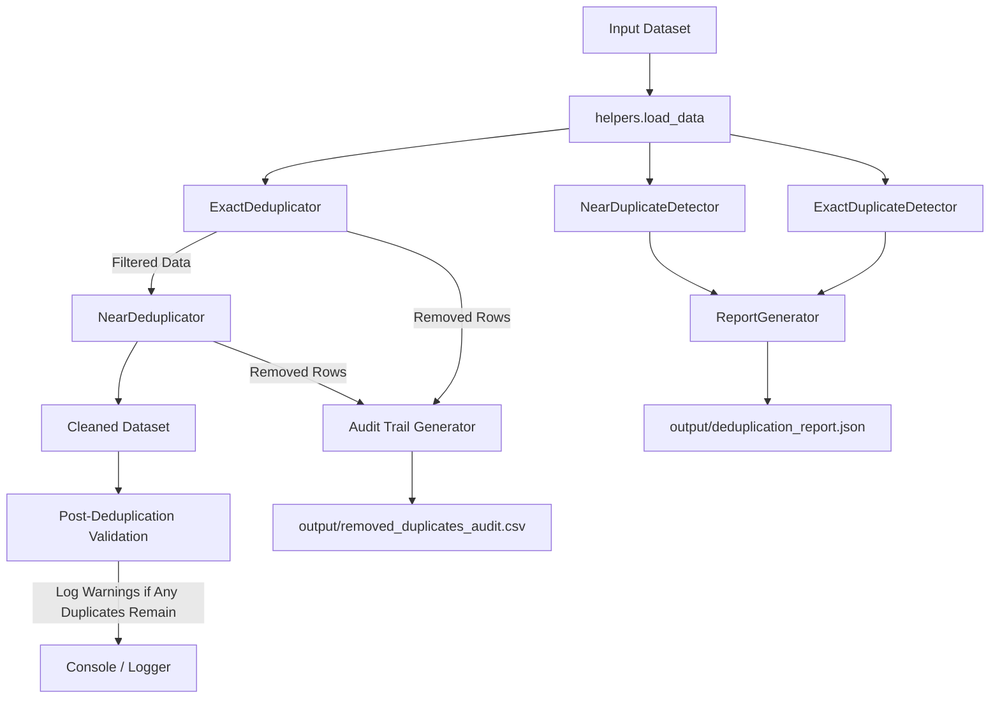

# Duplicate Detection & Record Deduplication Framework

A reusable, production-ready enterprise data quality framework for detecting and resolving duplicates in ETL pipelines. This module identifies completely identical rows and near-duplicates (matching key columns), applies customizable resolution strategies, creates a comprehensive audit trail of removed records, and generates quality validation reports.

---

## Architecture

The framework is structured using Clean Architecture and Separation of Concerns:
- **Detectors**: Responsible for identifying duplicate patterns without modifying any state or datasets.
- **Deduplicators**: Responsible for applying specific row-retention rules to create clean data copies.
- **Reports**: Generates the CSV audit logs and JSON performance summaries.
- **Config**: Centralized settings for pipeline parameters.
- **Utils**: Contains logging configuration and standard I/O helpers.



---

## Folder Structure

```
duplicate_detection/
├── config/
│   └── settings.py                  # Pipeline configurations, paths, defaults
├── detectors/
│   ├── __init__.py
│   ├── exact_duplicate_detector.py  # Exact row match identification
│   └── near_duplicate_detector.py   # Row match identification on subsets
├── deduplicators/
│   ├── __init__.py
│   ├── deduplicate_exact.py          # Row removal for exact duplicates
│   └── deduplicate_near.py           # Row removal for near duplicates using strategies
├── reports/
│   ├── __init__.py
│   └── report_generator.py          # Formats JSON summaries and CSV audits
├── utils/
│   ├── __init__.py
│   ├── logger.py                    # Enterprise logger setup
│   ├── exceptions.py                # Pipeline exception definitions
│   └── helpers.py                   # Data loaders and savers
├── sample_data/
│   └── customers.csv                # Mock customer dataset for testing
├── output/                          # (Generated) Deduplication artifacts
├── logs/                            # (Generated) Runtime log files
├── main.py                          # CLI runner script
├── requirements.txt                 # Project dependencies
└── README.md                        # Documentation
```

---

## Supported Strategies

When resolving duplicates (exact or near-duplicates by key columns), the framework supports three strategies:

1. **`keep_first`**: Keeps the first record matching the duplicates criteria and drops subsequent rows.
2. **`keep_last`**: Keeps the last record matching the duplicates criteria and drops previous rows.
3. **`keep_most_complete`**: Evaluates completeness row-by-row by counting the number of columns with non-null, non-NaN, and non-empty (whitespace-only strings are treated as empty) values. Keeps the row with the maximum count. If a tie occurs, falls back to the first record in the tied set.

---

## Installation

Ensure you have Python 3.12+ installed. Install the framework dependencies by running:
```bash
pip install -r requirements.txt
```

---

## Usage

Run the pipeline using the CLI entrypoint:
```bash
python main.py sample_data/customers.csv
```

### Advanced CLI Arguments
- `--strategy`: Specify the deduplication strategy (`keep_first`, `keep_last`, `keep_most_complete`). Default is `keep_first`.
- `--keys`: Space-separated list of column names to group near duplicates. Default is `customer_id email`.

Example:
```bash
python main.py sample_data/customers.csv --strategy keep_most_complete --keys customer_id email
```

---

## Audit Trail

Every removed record is saved to `output/removed_duplicates_audit.csv`. It contains the following columns:
* **`Original Row Index`**: The original row index in the raw DataFrame (0-indexed).
* **`Duplicate Type`**: The type of duplicate identified (`Exact` or `Near`).
* **`Reason Removed`**: Explanatory reason detailing which key was matched and which row index was kept.
* **`Strategy Used`**: The configuration strategy applied (`keep_first`, `keep_last`, or `keep_most_complete`).
* **`Timestamp`**: The ISO 8601 timestamp (UTC) of the deduplication.

---

## Example Output

### Deduplication Report (`output/deduplication_report.json`)
```json
{
    "status": "SUCCESS",
    "rows_before": 10,
    "rows_after": 6,
    "duplicates_removed": 4,
    "duplicate_percentage": 40.0,
    "strategy": "keep_first",
    "duplicate_columns": [
        "customer_id",
        "email"
    ]
}
```

---

## Configuration

You can customize file paths and default parameters directly in `config/settings.py`:
- `DEFAULT_DUPLICATE_KEYS`: Key columns used to cluster near duplicates.
- `DEFAULT_STRATEGY`: Default strategy used.
- `AUDIT_FILE_PATH`: Location for outputting the removed records audit CSV.
- `REPORT_FILE_PATH`: Location for the JSON comparison report.
- `CLEANED_DATA_PATH`: Location for saving the final cleaned dataset.

---

## Future Improvements

- **Fuzzy Matching Support**: Implement Levenshtein Distance or Jaro-Winkler algorithms on string columns (e.g. `name`, `address`) to detect typo-based near duplicates.
- **Scale-out Processing**: Support PySpark or Dask dataframes to process multi-gigabyte/terabyte datasets in distributed environments.
- **Custom Callback Strategies**: Allow users to write custom callback functions to choose which row to keep based on custom application logic.
